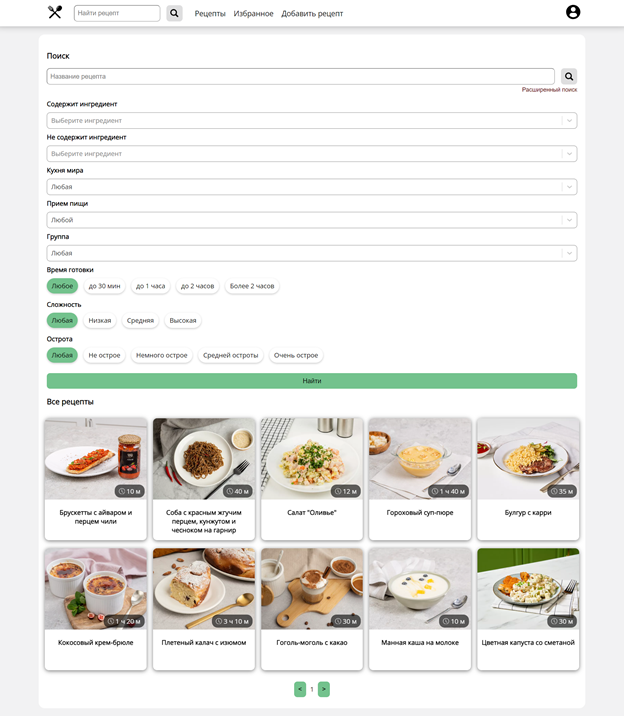
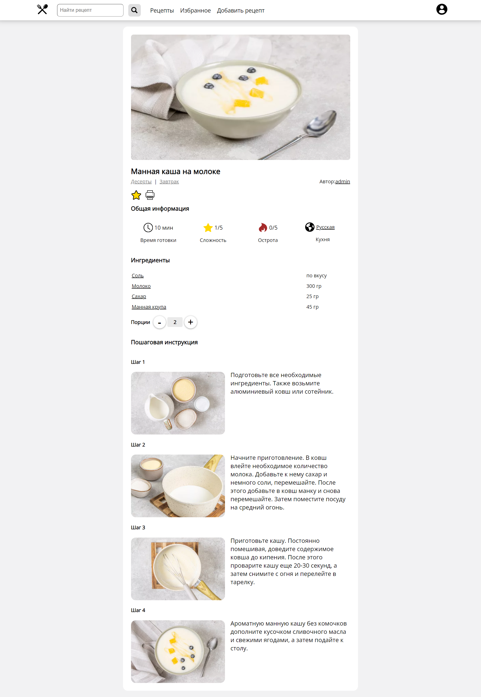
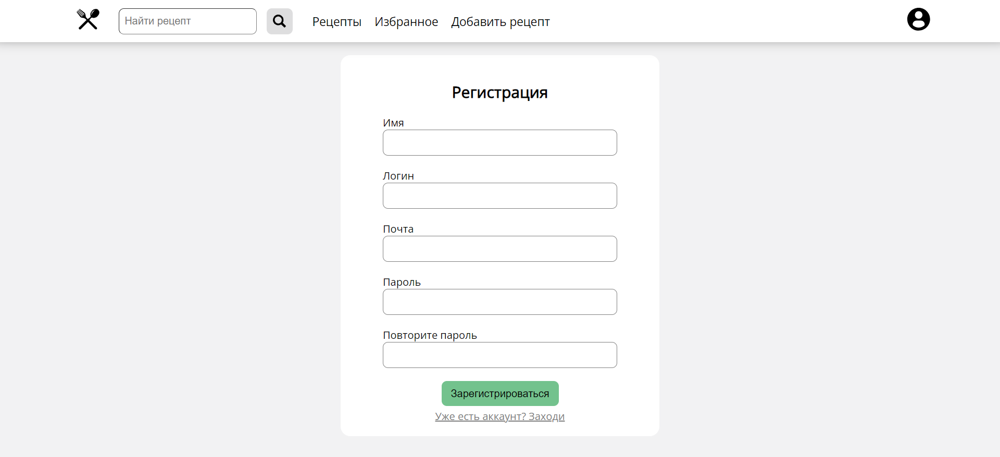
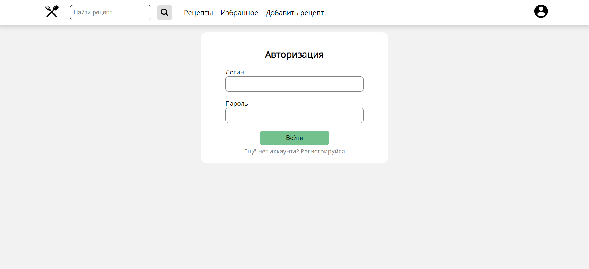
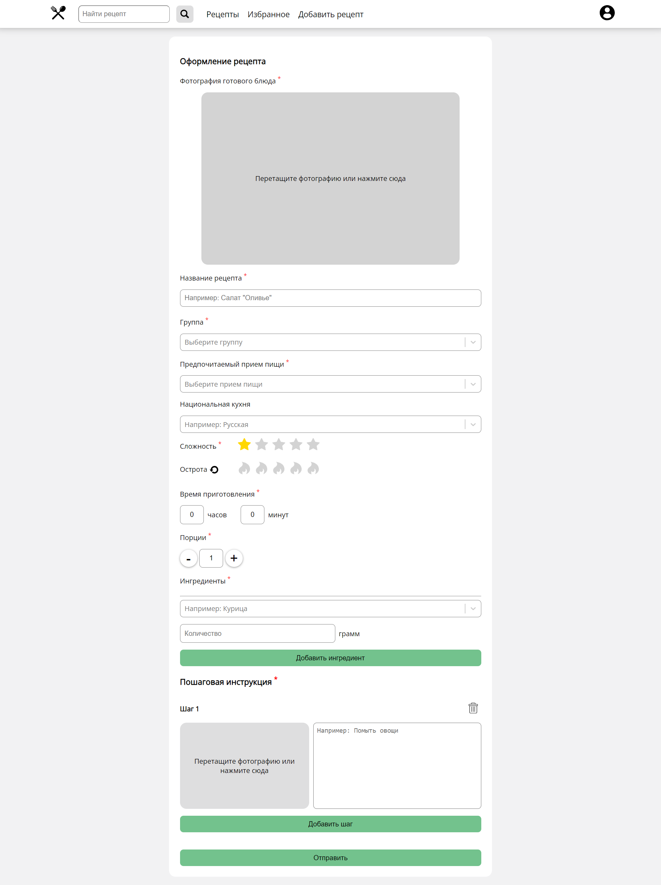
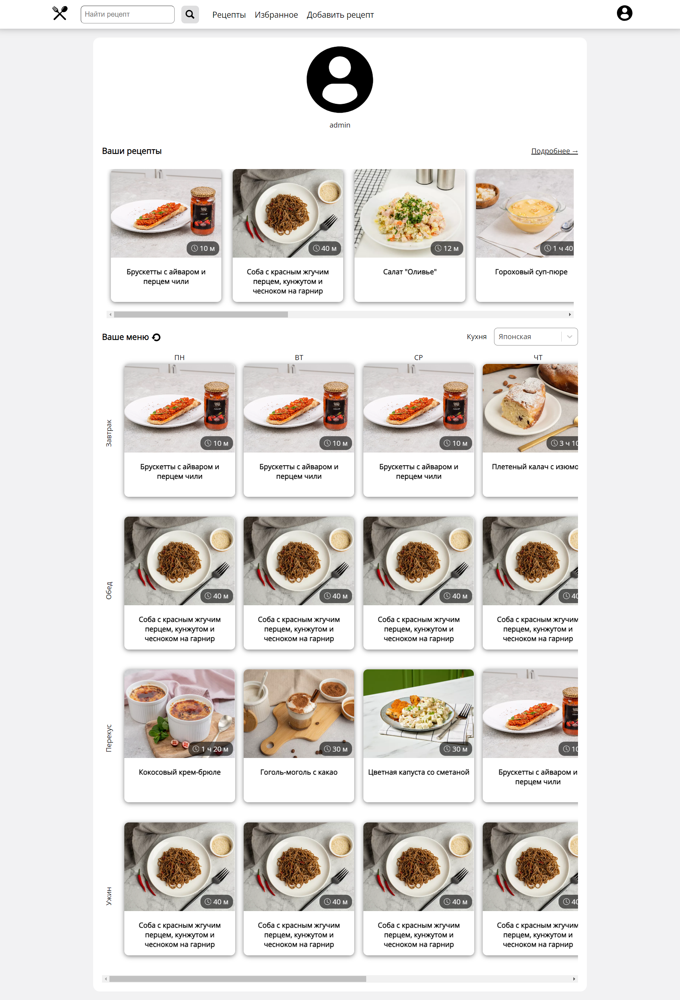

## Сайт с рецептами
Сайт для поиска, добавления и управления кулинарными рецептами.
Фронтенд написан на React + TypeScript, бэкенд — на C# .NET Minimal API.

## 📌 Возможности
- Просмотр списка рецептов
- Поиск по названию и ингредиентам
- Добавление, редактирование и удаление рецептов
- Создание профиля на сайте
- Составление меню на неделю для конкретной кухни

## ⚙️ Технологии

### Frontend

* React + TypeScript
* Vite
* Axios для работы с API

### Backend

* .NET Minimal API
* Entity Framework Core (PostgreSQL)
* Swagger для документации API
* JWT авторизация

## 📷 Скриншоты

